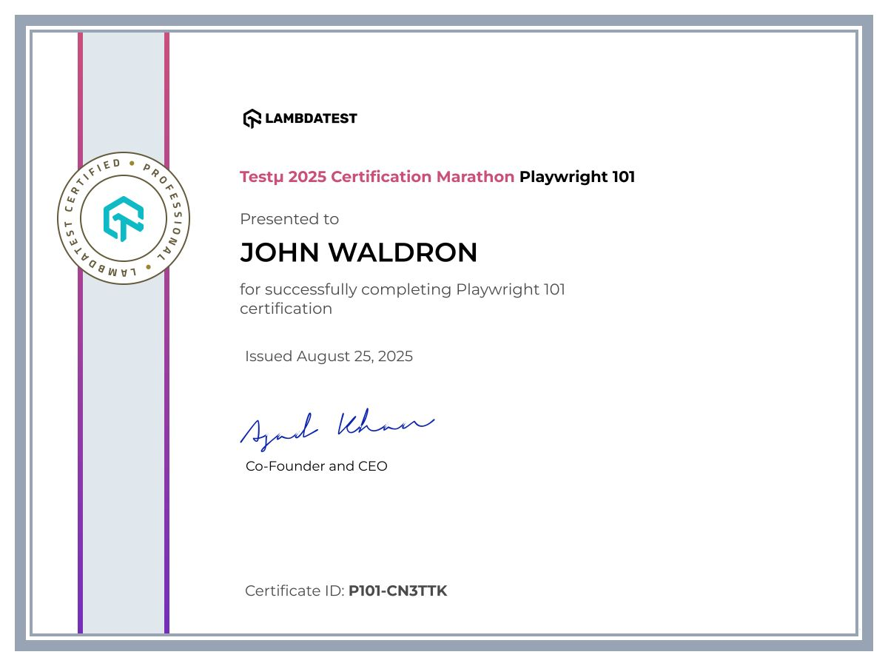

# Playwright 101 – LambdaTest Assignment by John Waldron

This repo contains the solution to the LambdaTest Playwright 101 certification assignment, completed by **John Waldron**.
[Verify credential via URL](https://www.lambdatest.com/certified/P101-CN3TTK)

## Scenarios Covered

| Scenario | Description                    | OS/Browser             |
|----------|--------------------------------|------------------------|
| 1A       | Simple form input/output       | Windows 10 / Chrome    |
| 1B       | Simple form input/output       | macOS / Firefox        |
| 2A       | Slider interaction             | Windows 10 / Chrome    |
| 2B       | Slider interaction             | macOS / Firefox        |
| 3A       | Form submission and validation | Windows 10 / Chrome    |
| 3B       | Form submission and validation | macOS / Firefox        |

Each test uses **LambdaTest’s Playwright Cloud Grid** and is run using custom capabilities, with videos and logs enabled.

## Folder Structure =>

playwright-101-assignment/
│
├── tests/
│ └── local/ # Original local tests (non-Lambda)
│ └── 101_final_sub_LT/ # Final 6 LambdaTest scenarios
│
├── .gitpod.yml
├── README.md
└── requirements.txt

note: (tests/lt_smoke_test.py) included to test with my lambda grid credentials

## LambdaTest Setup

- Test automation runs on LambdaTest via CDP WebSocket Grid.
- Playwright Python bindings used (`playwright.sync_api`)
- Cookies and popups handled on necessary basis via explicit locators

## Test Evidence

Each test run includes:
- Video recordings
- Console logs
- Metadata
- Visual step-by-step execution logs

Test IDs were captured and are available on the LambdaTest dashboard under the **LambdaTestPlaywrightBuild** project.
1)  Scenario 1 A: Simple Form,  Chrome/Windows  TestID: DA-WIN-2513202-1755713797835346621UHE
2)  Scenario 1 B: Simple Form,  Edge/Mac        TestID: DA-MAC-2513202-1755715522831990581VDZ
3)  Scenario 2 A: Slider Value, Chrome/Windows  TestID: DA-WIN-2513202-1755713758143036801IEF
4)  Scenario 2 B: Slider Value, Edge/Mac        TestID: DA-WIN-2513202-1755715587589039886WAO
5)  Scenario 3 A: Form Submit,  Chrome/Windows  TestID: DA-WIN-2513202-1755714181691612700EGP
6)  Scenario 3 B: Form Submit,  Edge/Mac        TestID: DA-MAC-2513202-1755716138334044809BFH

EDIT: Emailed final Test ID's used from my GITPOD use!!!

## Initial Private Repository

This repository is private and has been shared with the LambdaTest certifications team for review.
Update: Now public to show proof of playwright-python work

---

### Author

**John Waldron**  
Email: johndtwaldron@gmail.com  
GitHub: [https://github.com/johndtwaldron](https://github.com/johndtwaldron)
LinkedIN: https://www.linkedin.com/in/johndtwaldron/

### GITPOD

NOTE: Very new to me but this is how I worked it:

https://gitpod.io/new/#github.com/johndtwaldron/playwright-101-lambdatest-JDW
i.e put gitpod.io/# right in front of the repo url
Then make sure python is in the path running => export PATH=$PATH:/home/gitpod/.local/bin
Then run each of the 6 pytests individually, 
I.e => pytest ./tests/101_final_sub_LT/lt_test_simple_form_scen1_A.py 
... and so on

_____________________________________________________________________
